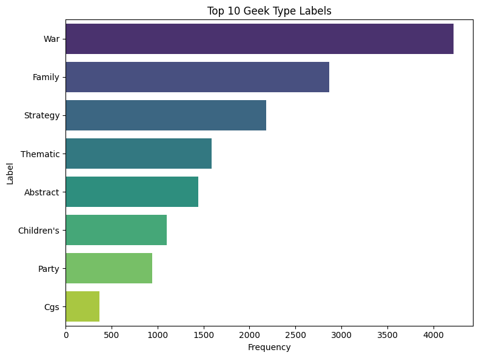
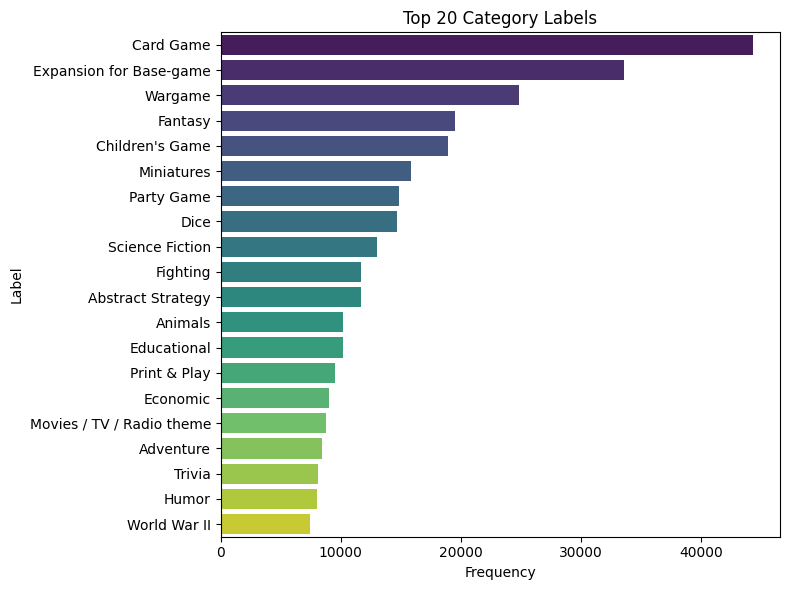
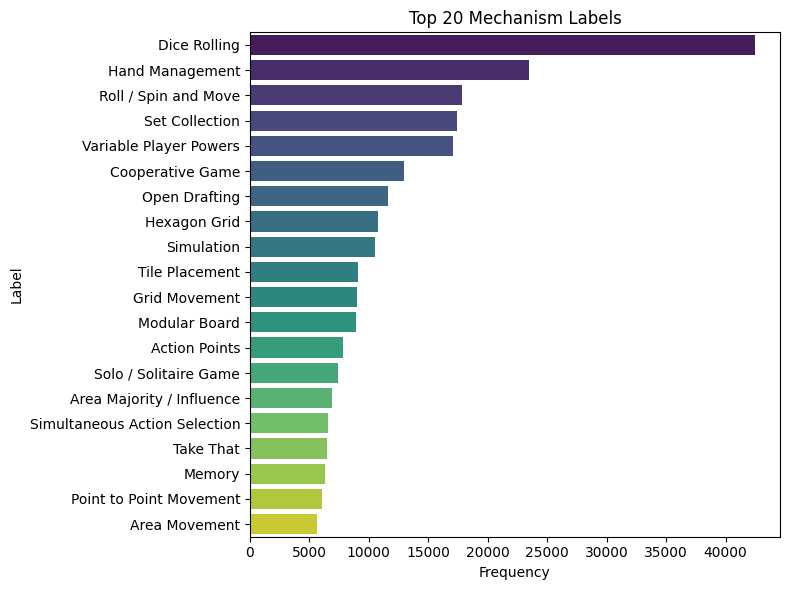
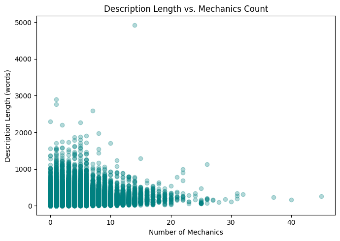
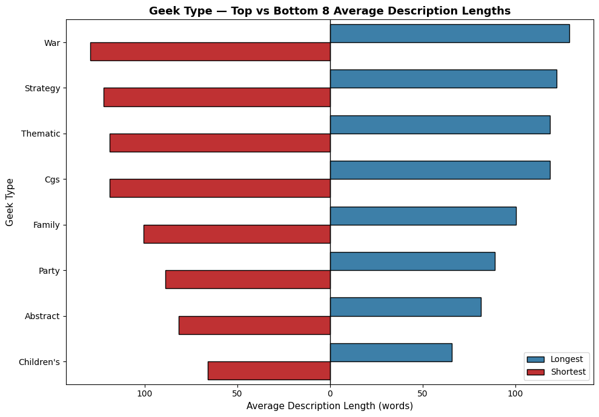
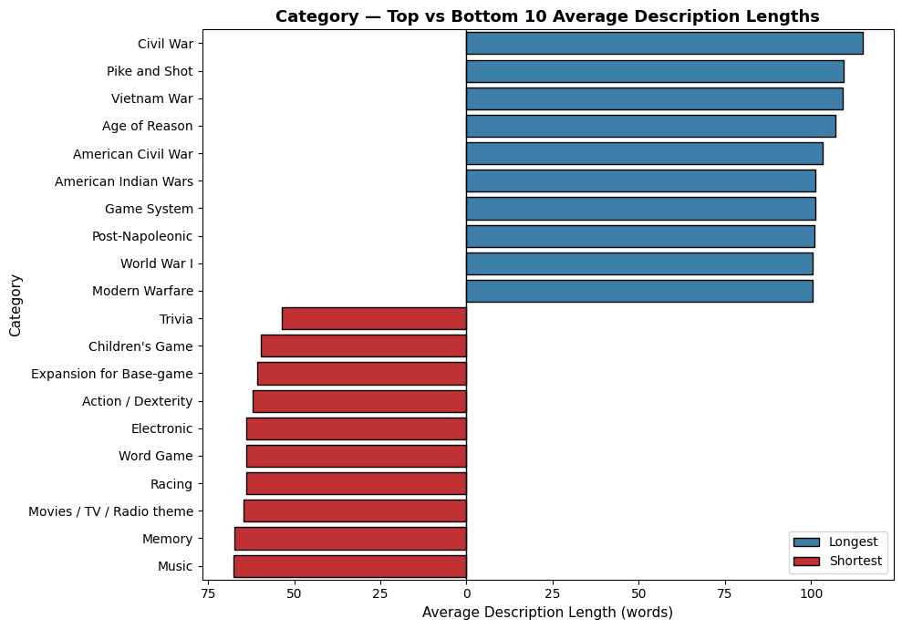
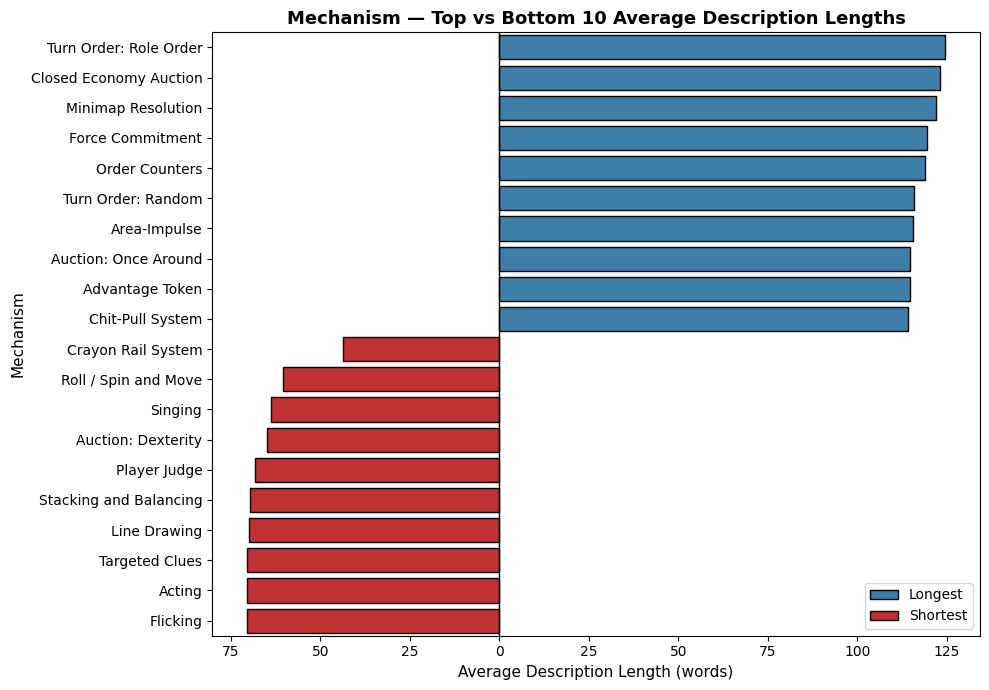
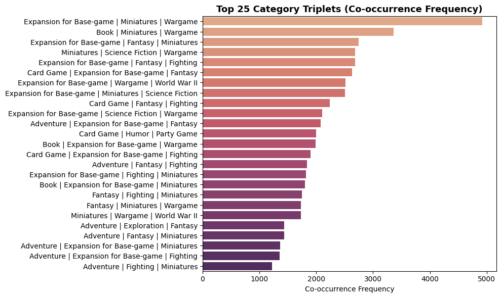
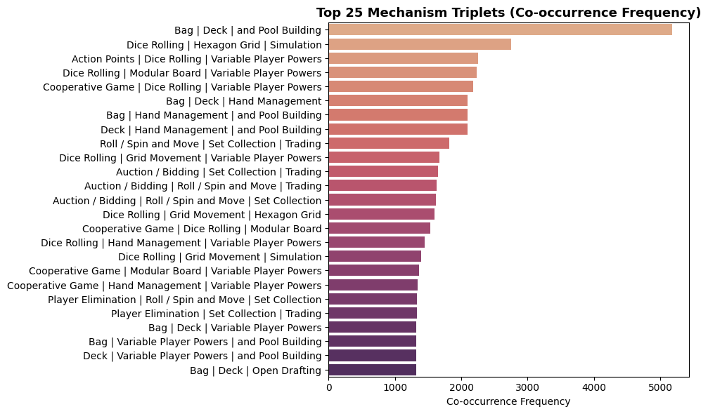

# 01 — Exploratory Data Analysis

## Table of Contents
- [Overview](#overview)
- [The Three Classification Tasks](#the-three-classification-tasks)
- [Label Distribution Analysis](#label-distribution-analysis)
  - [Geek Type](#geek-type-8-classes)
  - [Categories](#categories-85-labels)
  - [Mechanisms](#mechanisms-195-labels)
- [Label Frequency Plots](#label-frequency-plots)
- [Text Characteristics](#text-characteristics)
- [Description Length by Label](#description-length-by-label)
- [Label Co-occurrence Analysis](#label-co-occurrence-analysis)
- [Key EDA Findings for Modelling](#key-eda-findings-for-modelling)
- [Glossary](#glossary)

---

## Overview

This folder contains the EDA notebook that characterises the BGG dataset before any modelling begins. The goal is to understand the structure of the three classification tasks, quantify label imbalance, identify text characteristics that may affect model performance, and ground the experimental design in data-driven decisions.

**Input:** `bgg_clean_lemmatized.parquet` (165,708 games)  
**Notebook:** `Análise_Exploratória.ipynb`

---

## The Three Classification Tasks

| Task | Label type | Labels | Games with label | Avg labels/game |
|---|---|---|---|---|
| `geek_type` | Single-label | 8 | 14,713 | 1.00 |
| `categories` | Multi-label | 85 | 165,709 | 2.74 |
| `mechanisms` | Multi-label | 195 | 143,016 | 2.94 |

Not all games have all three labels — geek_type in particular is missing for ~90% of the corpus, which defines the training set size for Phase 1 and 2.

---

## Label Distribution Analysis

### Geek Type (8 classes)

| Label | Count | % of subset |
|---|---|---|
| War | 4,219 | 28.7% |
| Family | 2,867 | 19.5% |
| Strategy | 2,180 | 14.8% |
| Abstract | 1,847 | 12.6% |
| Thematic | 1,403 | 9.5% |
| Children's | 942 | 6.4% |
| Party | 756 | 5.1% |
| Customizable | 499 | 3.4% |

**Imbalance ratio:** 11.4× (War vs Customizable)  
**Shannon entropy:** 2.73 (out of max 3.0 for 8 classes)  
→ Relatively balanced. Standard CrossEntropy works without weighting.

### Categories (85 labels)

**Imbalance ratio:** 792× (Card Game: 44,384 vs Third-party Expansion: 56)  
**Shannon entropy:** 5.53  
**Top 5:** Card Game (44,384), Wargame (24,894), Fantasy (19,526), Abstract Strategy (17,001), Fighting (14,201)  
**Rare labels (< 500 examples):** 52 out of 85

### Mechanisms (195 labels)

**Imbalance ratio:** 4,245× (Dice Rolling: 42,453 vs rarest)  
**Shannon entropy:** 6.04  
**Top 5:** Dice Rolling (42,453), Hand Management (30,814), Variable Powers (26,789), Hex-and-Counter (23,045), Simulation (21,879)  
**Rare labels (< 100 examples):** ~40 out of 195

---

## Label Frequency Plots

### Geek Type — Top 10 labels by frequency

### Categories — Top 20 labels by frequency

### Mechanisms — Top 20 labels by frequency

---

## Text Characteristics

| Metric | Value |
|---|---|
| Mean description length | ~118 tokens |
| Median description length | ~95 tokens |
| Type-token ratio | 0.70–0.72 |
| Stopword density | <1% |
| Max token length (99th pct) | ~380 tokens |

**Key finding:** The vast majority of descriptions fit within BERT's 512-token limit. The 99th percentile is ~380 tokens, meaning truncation will affect fewer than 1% of games.

The high type-token ratio (0.70+) indicates rich, diverse vocabulary — game descriptions use domain-specific jargon ("hexagonal grid", "worker placement", "deckbuilding") that lemmatization preserves well.

---

## Description Length by Label

Games within specific categories or using specific mechanisms tend to have systematically longer or shorter descriptions. This matters because longer descriptions give the model more signal.

### Description length vs. number of mechanisms

Positive correlation (r = 0.18) — games with more mechanisms have longer descriptions, likely because complex games require more explanation.

### Description length by Geek Type

### Description length by Category

### Description length by Mechanism

---

## Label Co-occurrence Analysis

Pearson correlation between label presence vectors:

| Pair | Correlation |
|---|---|
| mechanisms ↔ categories | **0.36** |
| description length ↔ mechanisms | 0.18 |
| description length ↔ categories | ~0.12 |

**Finding:** mechanisms and categories are moderately correlated — games with more mechanisms tend to have more categories. This is the empirical basis for expecting that explicit label correlation modelling (MLGN, Phase 4) may help on the mechanisms task.

Within categories, strong co-occurrences include:
- Wargame + World War II
- Card Game + Hand Management
- Fantasy + Fighting

Within mechanisms, consistent with Martoglia & Pontiroli (2021):
- Dice Rolling ↔ Push Your Luck
- Hand Management ↔ Deck Building
- Hex-and-Counter ↔ Simulation

### Category co-occurrence heatmap

### Mechanism co-occurrence heatmap

---

## Key EDA Findings for Modelling

1. **Geek type is easy but small.** 14,713 games, mild imbalance — ideal for pipeline validation (Phase 1 & 2).

2. **Categories is the sweet spot.** 165,708 games, 85 labels, moderate imbalance (792×) — large enough for BERT to generalise, small enough label space to be manageable. This is Phase 3.

3. **Mechanisms is the hard problem.** 195 labels, extreme imbalance (4,245×), ~40 labels with fewer than 100 examples. Rare label failure is almost guaranteed without aggressive handling. This is the intended Phase 4 / MLGN task.

4. **Text alone has limits.** Game descriptions often use overlapping vocabulary across semantically adjacent categories (War games and Strategy games, Family games and Children's games). The moderate type-token ratio suggests the text carries genuine signal, but per-class ambiguity will create a performance ceiling.

5. **Spearman r(F1, support) = 0.25–0.27** — confirmed in Phase 3 results — meaning label frequency is a statistically significant but not dominant predictor of per-label performance. Topic specificity (war games have very distinct vocabulary) matters more than raw count.

---

## Glossary

**Co-occurrence** — Two labels co-occur when they appear together on the same game. If `Wargame` and `World War II` frequently appear on the same games, they have high co-occurrence. This is the basis for building a label correlation graph in MLGN.

**Corpus** — The complete collection of text documents used in a study. Here, the corpus is all 165,708 game descriptions.

**EDA (Exploratory Data Analysis)** — The process of visually and statistically examining a dataset before building models. Goal: understand distributions, spot problems (outliers, missing data, imbalance), and inform modelling decisions.

**Imbalance ratio** — The ratio between the most frequent and least frequent class in a dataset. An imbalance ratio of 792 means the most common category (`Card Game`) appears 792 times more often than the rarest one. High imbalance makes rare classes very hard to learn.

**Label cardinality** — The average number of labels per data point. For categories: 2.74 labels/game on average. Higher cardinality = more complex multi-label problem.

**Label co-occurrence matrix** — A matrix where entry (i, j) = number of times label i and label j appear on the same game. Used to build the label correlation graph for MLGN.

**Multi-label** — A classification setting where each item can have multiple correct labels simultaneously. A game can be `Card Game`, `Fantasy`, and `Fighting` all at once.

**Pearson correlation** — A number between -1 and +1 measuring the linear relationship between two variables. +1 = perfect positive relationship, 0 = no relationship, -1 = perfect negative relationship.

**Percentile** — A value below which a given percentage of observations fall. The 99th percentile of token length = 380 means 99% of descriptions have 380 tokens or fewer.

**PMI (Pointwise Mutual Information)** — A measure of how much more (or less) two labels co-occur than expected by chance. High PMI = strong association. Used to weight edges in the label correlation graph.

**Shannon entropy** — A measure of information content or uncertainty in a distribution. Higher entropy = more evenly spread across labels = less imbalanced. Maximum entropy for 8 classes = 3.0 bits; for 85 classes = 6.41 bits.

**Single-label** — A classification setting where each item belongs to exactly one class (like `geek_type`: a game is War OR Family OR Strategy, not multiple).

**Spearman correlation** — A rank-based correlation coefficient (-1 to +1) that measures whether one variable consistently increases as the other increases, without assuming a linear relationship. Used here to test whether labels with more training examples tend to have higher F1 scores.

**Support** — The number of training examples for a given label. A label with support=34 has only 34 positive examples in the training set — very little for a model to learn from.

**Token** — A single unit of text after splitting (tokenisation). Usually a word or sub-word fragment. BERT uses sub-word tokens via WordPiece, so `playing` might stay as one token, while `deckbuilding` might split into `deck` + `##building`.

**Token limit (512)** — BERT can process at most 512 tokens in a single input. Descriptions longer than this are truncated (the end is cut off). Since 99% of games are under 380 tokens, this is rarely an issue here.

**Truncation** — Cutting off text that exceeds the model's maximum input length. Text after the 512th token is simply discarded.

**Type-token ratio (TTR)** — (Unique words) / (Total words). A ratio of 0.72 means 72% of all words used are unique — indicating rich vocabulary diversity.
