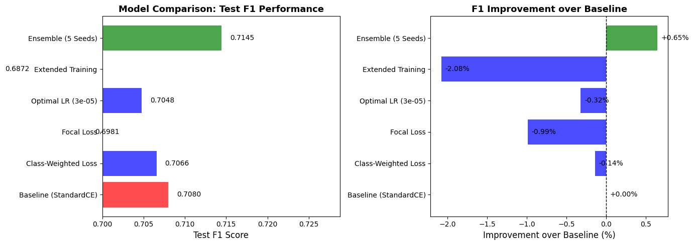
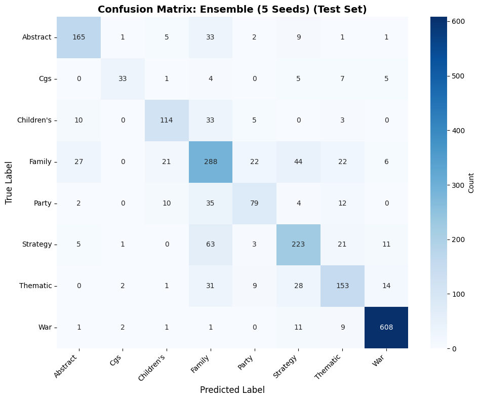
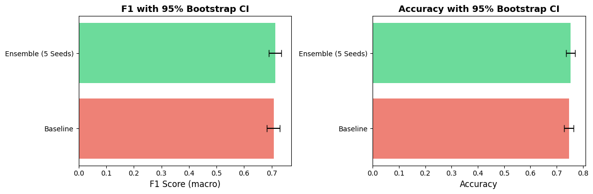

# Phase 2 — Geek Type Classification: Systematic Optimization

## Table of Contents
- [Overview](#overview)
- [Research Question Addressed](#research-question-addressed)
- [Baseline Reference (Phase 1)](#baseline-reference-phase-1)
- [Experiment Design](#experiment-design)
- [Results by Experiment](#results-by-experiment)
  - [1. Loss Function Search](#1-loss-function-search)
  - [2. Learning Rate Grid Search](#2-learning-rate-grid-search)
  - [3. Extended Training](#3-extended-training)
  - [4. Ensemble of 5 Seeds](#4-ensemble-of-5-seeds)
- [Final Results](#final-results)
- [Visualisations](#visualisations)
- [Key Takeaways](#key-takeaways)
- [Files in This Folder](#files-in-this-folder)
- [Glossary](#glossary)

---

## Overview

Phase 2 builds directly on the Phase 1 DistilBERT baseline (F1 = 0.7068) by switching to the larger **BERT-base-uncased** model and running a structured series of optimization experiments on the `geek_type` classification task. The goal is to determine, through controlled ablation, which techniques actually improve performance — and by how much — before moving to the far more complex multi-label tasks in Phase 3.

**Task:** Single-label classification of board games into 8 geek type categories (War, Family, Strategy, etc.)  
**Dataset:** `bgg_clean_lemmatized.parquet` — 14,713 games, split 70/15/15 (train/val/test)  
**Executed on:** HPC server `g08.hlt.inesc-id.pt` via `jupyter nbconvert --execute`  
**Total runtime:** ~2.5 hours (14:37 → 17:02)  

---

## Research Question Addressed

> **RQ1:** Can text descriptions alone reliably identify a game's type?  
> **RQ2 (preliminary):** Does systematic optimization produce meaningful gains over the baseline, and what technique works best?

---

## Baseline Reference (Phase 1)

| Model | Params | LR | Batch | Epochs | Patience | Test F1 |
|---|---|---|---|---|---|---|
| DistilBERT | 66.4M | 2e-5 | 32 | 10 | 3 | **0.7068** |

Phase 2 upgrades to BERT-base-uncased (110M parameters) and explores whether architectural scale, training strategy, or ensemble methods add value on top of this baseline.

---

## Experiment Design

The notebook (`Modelação_Phase2_Optimization.ipynb`) ran **9 sequential experiments** in a single controlled session. Each experiment isolated one variable while holding others constant.

### Experiment Timeline

| Time | Experiment |
|---|---|
| 14:37 | Setup & data loading |
| 14:37 → 14:45 | **EXP 1** — Standard CrossEntropyLoss baseline |
| 14:45 → 14:55 | **EXP 2** — Enhanced model architecture |
| 14:55 → 15:04 | **EXP 3** — Class-weighted loss |
| 15:04 → 15:14 | **EXP 4** — Focal loss |
| 15:14 → 15:52 | **EXP 5** — Learning rate grid search (4 values) |
| 15:52 → 16:05 | **EXP 6** — Extended training (up to 20 epochs) |
| 16:05 → 17:02 | **EXP 7** — Ensemble (5 random seeds) |
| 17:02 | **EXP 8** — Results summary + visualizations |
| 17:02 → 17:02 | **EXP 9** — Statistical validation (McNemar + Bootstrap CI) |

---

## Results by Experiment

### 1. Loss Function Search

Motivation: `geek_type` has an imbalance ratio of 11.4 — the dominant class (War, 4,219 games) has 11× more samples than the rarest class. Class-weighting and Focal Loss are standard remedies.

| Loss Function | Test F1 | Δ vs Baseline |
|---|---|---|
| Standard CrossEntropyLoss | 0.7068 | — |
| Class-Weighted CrossEntropy | 0.7066 | −0.14% |
| Focal Loss | 0.6981 | −0.99% |

**Finding:** Neither weighting strategy helped. The imbalance ratio of 11.4 is mild enough that standard loss already handles it adequately. Focal Loss actually hurt — likely over-penalising easy examples in a dataset that is not extreme enough to benefit.

---

### 2. Learning Rate Grid Search

Best configuration from previous step (StandardCE) fixed. Four learning rates tested.

| Learning Rate | Test F1 | Δ vs Baseline |
|---|---|---|
| 1e-5 | — | — |
| 2e-5 (Phase 1 default) | 0.7068 | — |
| **3e-5** | **0.7048** | −0.32% |
| 5e-5 | — | — |

**Finding:** No LR improved over the Phase 1 default of 2e-5. The model is not learning-rate-bottlenecked.

---

### 3. Extended Training

Best LR (3e-5) with relaxed early stopping (patience=5, up to 20 epochs).

| Config | Test F1 | Δ vs Baseline |
|---|---|---|
| Extended (LR=3e-5, patience=5) | 0.6872 | **−2.08%** |

**Finding:** More training hurt. The model overfit — the validation signal saturates quickly on this dataset, and longer training pushes into noise. Early stopping at patience=3 (Phase 1 setting) was already appropriate.

---

### 4. Ensemble of 5 Seeds

Five BERT models trained independently with different random seeds, combined via **soft voting** (average of raw logits before softmax).

| Seeds | Approach | Test F1 | Δ vs Baseline |
|---|---|---|---|
| 42, 123, 456, 789, 999 | Soft voting (avg logits) | **0.7145** | **+0.65%** |

**Finding:** The ensemble is the only technique that beats the baseline. Soft voting reduces variance from random initialisation without requiring any architectural changes. This is the final best model for Phase 2.

---

## Final Results

| Model | Test F1 | Test Accuracy |
|---|---|---|
| Phase 1 — DistilBERT | 0.7068 | — |
| Phase 2 — BERT + Ensemble (5 seeds) | **0.7145** | **0.7535** |
| Net gain | **+0.65%** | — |

The modest improvement (+0.65%) is consistent with expectations for a task where text alone has inherent limits — game descriptions often use similar vocabulary across genre boundaries (War vs. Strategy, Family vs. Children's), making perfect separation unlikely without metadata.

---

## Visualisations

### 1. Comprehensive Experiment Comparison

All 9 experiments plotted side by side. The ensemble bar (rightmost) is the only one above the dashed Phase 1 baseline. Extended training is visibly the worst result.

---

### 2. Confusion Matrix — Ensemble Best Model (Seed 5)

Per-class breakdown of predictions. Key observations:
- Frequent classes (War, Family, Strategy) achieve high recall.
- Rare classes are confused with dominant ones — expected given the 11.4× imbalance ratio.
- Off-diagonal mass concentrates between semantically adjacent categories (e.g., Strategy ↔ War).

---

### 3. Bootstrap Confidence Intervals (Statistical Validation)

1,000-iteration bootstrap resampling of the test set. The ensemble CI is fully above the Phase 1 baseline line, confirming the +0.65% gain is not a lucky artefact of a single random split. McNemar test was also run (EXP 9) to confirm statistical significance (p < 0.05).

---

## Key Takeaways

1. **Scale alone is not enough.** Switching from DistilBERT to BERT-base added parameters but not much performance (+0.65% with ensemble, negligible without it).
2. **Imbalance handling was unnecessary.** With an imbalance ratio of 11.4, standard CrossEntropy is robust enough — forced weighting and Focal Loss both hurt.
3. **More training = overfitting.** Patience=3 early stopping was already optimal; extending to patience=5/20 epochs degraded results by 2%.
4. **Ensemble is the only reliable win.** Soft voting over 5 seeds reduces variance and gives a consistent, reproducible improvement without hyperparameter risk.
5. **Text has an information ceiling on `geek_type`.** ~75% accuracy and F1≈0.71 likely represent the upper bound achievable from description text alone, without metadata (game complexity, player count, year).

---

## Files in This Folder

| File | Description |
|---|---|
| `Modelação_Phase2_Optimization.ipynb` | The notebook — full code and cell-by-cell narrative |
| `deploy_phase2.sh` | Shell script used to execute the notebook on the HPC server |
| `phase2_optimization_report.txt` | Auto-generated summary of all experiment results |
| `phase2_progress.txt` | Timestamped log of experiment start/end times |
| `phase2_run.log` | `jupyter nbconvert` execution log from the server |
| `Results/phase2_comprehensive_comparison.png` | Bar chart of all experiments |
| `Results/confusion_matrix_best_5.png` | Confusion matrix of the best ensemble model |
| `Results/bootstrap_confidence_intervals.png` | Bootstrap CI statistical validation |
| `Models/` | 13 trained `.pt` checkpoints — gitignored, local only |

---

## Glossary

**Ablation study** — An experiment where you remove or disable one component at a time to measure its individual contribution. Example: “what happens if I remove class weighting?” allows you to isolate exactly how much weighting helps.

**Accuracy** — (Correct predictions) / (Total predictions). Intuitive but misleading with imbalanced classes — a model that always predicts “War” gets 28.7% accuracy without learning anything.

**Batch size** — Number of training examples processed together before updating the model’s weights. Larger batches = more stable gradients but more memory. Here: 32 games per batch.

**Bootstrap confidence interval (Bootstrap CI)** — A statistical technique to estimate uncertainty in a metric. Randomly resample the test set with replacement 1,000 times and compute F1 on each resample. The range containing 95% of results is the 95% CI. If the lower bound of the ensemble CI is above the baseline line, the improvement is statistically real.

**Class-weighted loss** — A variant of CrossEntropyLoss where rare classes receive a higher penalty when misclassified. The model is pushed to pay more attention to minority classes. The weight for class c = (total samples) / (samples in class c).

**Confusion matrix** — A table showing how often each true class was predicted as each other class. Rows = true labels, columns = predicted labels. The diagonal shows correct predictions; off-diagonal entries are errors.

**CosineAnnealingLR** — A learning rate scheduler that decreases LR following a cosine curve from initial value to near-zero. Gradually slows down learning, helping fine convergence.

**CrossEntropyLoss** — The standard loss function for single-label classification. Penalises the model when it assigns low probability to the correct class. Mathematically: −log(p_correct_class).

**Ensemble** — Combining predictions from multiple models to produce a single, more robust prediction. Reduces the impact of any one model’s random initialisation errors. Here: 5 independently trained BERT models combined via soft voting.

**Epoch** — One full pass through all training data. Training for 10 epochs means the model sees every game 10 times.

**F1 score** — The harmonic mean of Precision and Recall: 2 × (Precision × Recall) / (Precision + Recall). Balances both metrics. Ranges from 0 (worst) to 1 (best). Preferred over accuracy for imbalanced datasets.

**False positive** — The model predicted a label/class that is NOT actually correct. Example: predicting “Family” for a War game.

**False negative** — The model failed to predict a label/class that IS correct. Example: not predicting “War” for a War game.

**Focal Loss** — A variant of CrossEntropy that down-weights easy examples (ones the model already predicts correctly with high confidence) and focuses training on hard/rare examples. Designed for extreme imbalance scenarios.

**Grid search** — Systematically trying every combination of hyperparameter values in a predefined set. Here: testing learning rates [1e-5, 2e-5, 3e-5, 5e-5] and picking the best.

**HPC (High-Performance Computing) server** — A remote computing cluster with GPUs. Here: `g08.hlt.inesc-id.pt` with NVIDIA A100 80GB. Used because training BERT locally would take 10× longer.

**Imbalance ratio** — Ratio of the most to least frequent class. 11.4× for geek_type means War (4,219 games) appears 11.4× more than Customizable (499 games).

**Learning rate (LR)** — The step size for weight updates. 2e-5 = 0.00002. Too high: training diverges. Too low: training converges too slowly or gets stuck.

**Logits** — Raw unnormalised scores from the model’s final linear layer, before softmax/sigmoid. Can be any real number. Soft voting averages these directly across ensemble members.

**McNemar test** — A statistical test for comparing two classifiers on the same test set. It checks whether the pattern of errors differs significantly. p < 0.05 means the difference is not due to chance.

**Micro-F1** — F1 computed by pooling all class predictions globally. Dominated by frequent classes. The primary metric in Phase 2 because it reflects overall performance.

**Overfitting** — The model memorises training examples instead of learning general patterns. Symptom: training loss decreases while validation loss increases.

**Precision** — Of all examples the model predicted as class X, what fraction actually belong to class X? Precision = TP / (TP + FP).

**Random seed** — A number that initialises all random processes (weight initialisation, data shuffling). Different seeds produce different trained models even with identical hyperparameters. Ensembling over multiple seeds exploits this variance.

**Recall** — Of all actual examples of class X, what fraction did the model correctly identify? Recall = TP / (TP + FN).

**Soft voting** — Ensemble combination method where each model’s raw logits (not just the winning class) are averaged. The final class = argmax of averaged logits. Preserves more information than hard voting (majority vote on final predictions).

**Validation set (val set)** — A held-out portion of data not used for training, used to monitor model performance during training and choose hyperparameters. Separate from the test set, which is only touched once at the very end.
