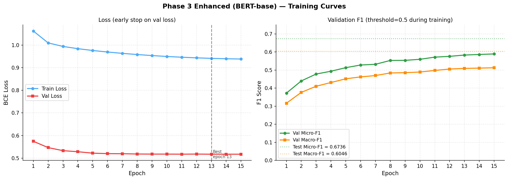
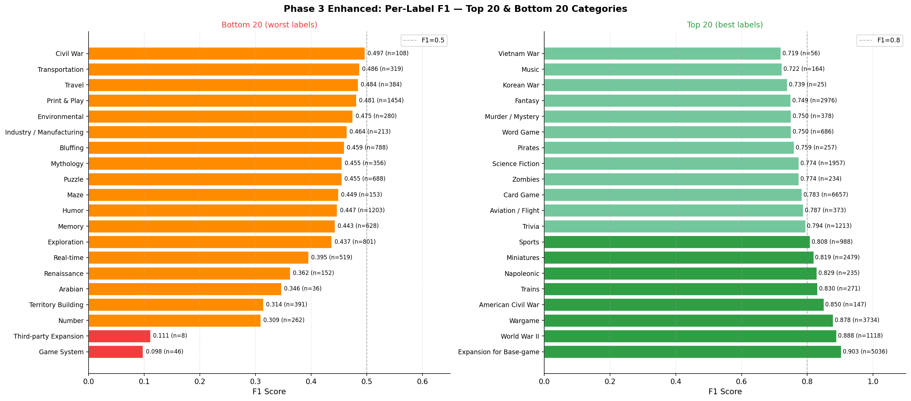
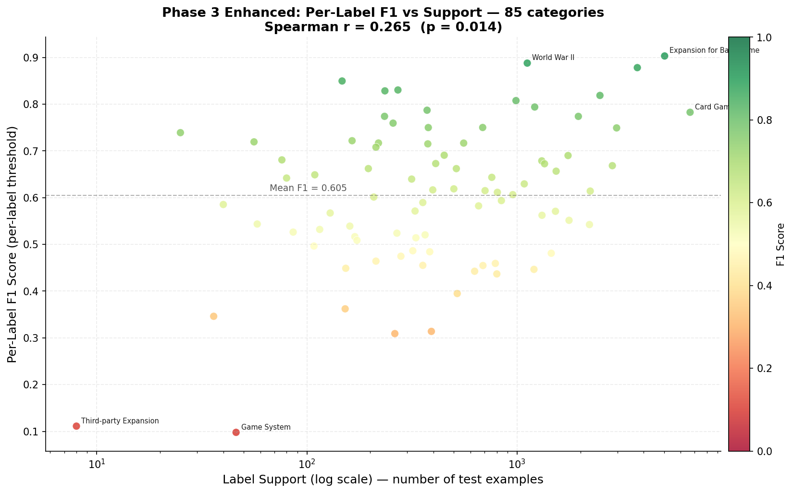
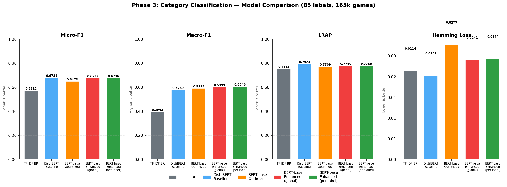
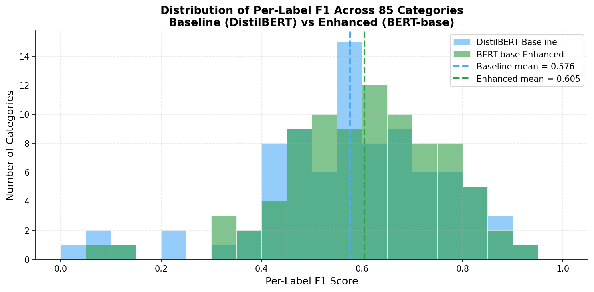

# 04 — Phase 3: Multi-Label Category Classification (BERT Binary Relevance)

## Table of Contents
- [Overview](#overview)
- [Research Questions Addressed](#research-questions-addressed)
- [The Multi-Label Problem](#the-multi-label-problem)
- [Iteration 1 — Baseline (DistilBERT-BR)](#iteration-1--baseline-distilbert-br)
- [Iteration 2 — Optimized (BERT-base, Weighted Loss) — BROKEN](#iteration-2--optimized-bert-base-weighted-loss--broken)
- [Iteration 3 — Enhanced (BERT-base, Fixed) — Best Result](#iteration-3--enhanced-bert-base-fixed--best-result)
- [Cross-Iteration Summary](#cross-iteration-summary)
- [What Remains Unexplained (Phase 4 Motivation)](#what-remains-unexplained-phase-4-motivation)
- [Recommended Next Step: Phase 4 — MLGN on Categories](#recommended-next-step-phase-4--mlgn-on-categories)
- [Files in This Folder](#files-in-this-folder)
- [Glossary](#glossary)

---

## Overview

Phase 3 is the first genuine multi-label classification phase of the thesis. The task switches from 8 single-label geek types to **85 simultaneous category labels** across 165,708 games — a fundamentally different problem where each game can belong to multiple categories at once.

This phase ran **three successive iterations**, each fixing a discovered problem from the previous one. All three ran on the HPC server (NVIDIA A100 80GB) using standalone Python scripts submitted via `deploy_phase2.sh`-style deployment.

**Notebook for exploration:** `Modelling_Phase03_Categories.ipynb`  
**Scripts:** `Scripts/train_phase3.py`, `train_phase3_optimized.py`, `train_phase3_enhanced.py`  
**GPU:** NVIDIA A100 80GB PCIe (79.1 GB VRAM)  

---

## Research Questions Addressed

> **RQ1:** Can text descriptions alone identify game categories in a multi-label setting?  
> **RQ2 (setup):** Is Binary Relevance (BERT-BR) a solid baseline before introducing explicit label correlation (MLGN)?  
> **RQ3:** How do text characteristics (support, description length) correlate with per-label performance?

---

## The Multi-Label Problem

| Property | Value |
|---|---|
| Total games | 165,708 |
| Labels | 85 |
| Avg labels per game | 2.74 |
| Imbalance ratio | 792× (Card Game: 44,384 vs Third-party Expansion: 56) |
| Labels with < 500 examples | 52 / 85 |

Binary Relevance (BR) treats each of the 85 labels as an independent binary classification problem — the model outputs 85 independent sigmoid probabilities, and a threshold determines which labels are predicted as present. This is the standard starting point before more sophisticated architectures that model label dependencies (like MLGN in Phase 4).

**Loss function:** `BCEWithLogitsLoss` (binary cross-entropy with numerically stable sigmoid) — the multi-label analogue of CrossEntropyLoss.

---

## Iteration 1 — Baseline (DistilBERT-BR)

**Script:** `Scripts/train_phase3.py`  
**Results:** `Results/Baseline/`  
**Runtime:** 17:19 → 18:56 (~1h 37min)

### Configuration

| Setting | Value |
|---|---|
| Model | distilbert-base-uncased (67M params) |
| Max length | 256 tokens |
| Batch size | 32 |
| LR | 2e-5, CosineAnnealingLR |
| Epochs | 10, patience=3 (on val Micro-F1) |
| Loss | BCEWithLogitsLoss (unweighted) |
| Stratification | `sklearn.train_test_split` — ⚠ NOT multi-label aware |
| Threshold | 0.350 (optimised on validation set) |

### Results

| Model | Micro-F1 | Macro-F1 | LRAP | Hamming |
|---|---|---|---|---|
| TF-IDF Binary Relevance | 0.5712 | 0.3942 | 0.7515 | 0.0214 |
| **DistilBERT-BR** | **0.6781** | **0.5760** | **0.7923** | **0.0203** |

### Training curve

Epochs 1–6 showed consistent improvement in val Micro-F1 (0.5549 → 0.6703). The model began to plateau at epoch 6 and the best checkpoint was saved at epoch 9 (0.6717). Val loss started increasing from epoch 6 onward — the first signal of impending overfitting.

> Training curves for the Enhanced run (Iteration 3) are shown below in the [Enhanced Training Curves section](#iteration-3--enhanced-bert-base-fixed--best-result).

### Per-label highlights

**Top 5 (highest F1):**
| Label | F1 | Support |
|---|---|---|
| American Civil War | 0.9018 | 141 |
| Expansion for Base-game | 0.8940 | 5,031 |
| World War II | 0.8849 | 1,090 |
| Wargame | 0.8757 | 3,664 |
| Napoleonic | 0.8375 | 225 |

**Bottom 5 (lowest F1):**
| Label | F1 | Support |
|---|---|---|
| Arabian | 0.0909 | 40 |
| Korean War | 0.0571 | 34 |
| Third-party Expansion | 0.0000 | 6 |
| Game System | 0.1404 | 53 |
| Number | 0.2079 | 265 |

**Key observation:** Top performers are thematically distinct categories with strong vocabulary signal (war periods, game types). Bottom performers are either extremely rare (<50 examples) or semantically vague ("Number", "Game System").

### Problems identified

1. ⚠ **Stratification was not multi-label aware** — `sklearn.train_test_split` ignores label co-occurrences. Rare labels may be over/under-represented in splits.
2. ⚠ **No class weighting** — 792× imbalance completely ignored. Rare labels survive because DistilBERT is already powerful, but they're undertrained.
3. ⚠ **Val loss increased from epoch 6** while val F1 kept improving — early stopping criterion (val Micro-F1) allowed the model to overfit.

---

## Iteration 2 — Optimized (BERT-base, Weighted Loss) — BROKEN

**Script:** `Scripts/train_phase3_optimized.py`  
**Results:** `Results/Optimized/`  
**Runtime:** 19:07 → 23:53 (~4h 46min)

### Changes from Baseline

| Change | Rationale |
|---|---|
| Model → bert-base-uncased (110M params) | More capacity for 85-label task |
| Stratification → `iterative_train_test_split` (skmultilearn) | Properly preserves multi-label distributions |
| Loss → BCEWithLogitsLoss with `pos_weight` per label | Counter-act 792× imbalance |
| Per-label threshold optimisation | Different labels need different thresholds |
| LR scheduler → linear warmup + linear decay | Standard for BERT fine-tuning |
| Epochs → 15, patience=5 | Allow more training time |

### The Critical Bug: Uncapped pos_weight

`pos_weight` for label $l$ is computed as:
$$w_l = \frac{N_{neg}^{(l)}}{N_{pos}^{(l)}}$$

For "Third-party Expansion" (8 positives out of 116,943 training games):
$$w = \frac{116,935}{8} = 2{,}922$$

A weight of 2,922 means every single positive example for that label contributes 2,922× as much to the loss as a negative. This destroys gradient calibration: the loss is dominated by a handful of tiny labels, the model learns to output high sigmoid values everywhere to avoid the massive penalty, and calibration for all common labels collapses.

### Results

| Model | Micro-F1 | Macro-F1 | LRAP | Hamming |
|---|---|---|---|---|
| TF-IDF BR | 0.5693 | 0.3904 | 0.7557 | 0.0219 |
| Baseline (DistilBERT) | 0.6781 | 0.5760 | 0.7923 | 0.0203 |
| **BERT-BR Optimized** | **0.6484** | **0.5895** | **0.7709** | **0.0278** |

**Micro-F1 dropped −2.97% below baseline.** The model is generating more false positives (Hamming loss increased from 0.0203 → 0.0278), consistent with a calibration failure where the model over-predicts to avoid the extreme rare-label penalty.

**The only silver lining:** Macro-F1 improved slightly (+0.0135), and labels with F1=0.0 dropped from 1 to 0 — the extreme weighting did help rare labels at the cost of destroying common label precision.

### Training curve diagnostic

Train loss falls sharply (1.04 → 0.12) while val loss rises continuously from epoch 4 onward (0.51 → 1.27). This is a textbook overfitting pattern amplified by uncapped weights — the model memorises the rare positive examples in training but cannot generalise them.

---

## Iteration 3 — Enhanced (BERT-base, Fixed) — Best Result

**Script:** `Scripts/train_phase3_enhanced.py`  
**Results:** `Results/Enhanced/`  
**Runtime:** 12:54 → 23:03 (~10h 9min)

### Four Fixes Applied

| Fix | Problem solved | Value |
|---|---|---|
| **FIX 1:** `pos_weight` capped at 10.0 | Prevented 2,922× weights destroying calibration | cap = 10.0 |
| **FIX 2:** Early stopping on **Val Loss** | Stopped overfitting (val loss was the honest signal) | patience = 5 |
| **FIX 3:** Label smoothing | Prevents sigmoid → 1.0 overconfidence on rare labels | smoothing = 0.1 |
| **FIX 4:** Dropout increased to 0.3 | Addresses train/val divergence in 110M param model | dropout = 0.3 (was 0.2) |

All other settings retained from the Optimized run: BERT-base, iterative stratification, per-label thresholds, linear warmup scheduler, LR=2e-5.

### Results

| Model | Micro-F1 | Macro-F1 | LRAP | Hamming | Labels F1>0.5 |
|---|---|---|---|---|---|
| TF-IDF BR | 0.5693 | 0.3904 | 0.7557 | 0.0219 | — |
| Baseline (DistilBERT-BR) | 0.6781 | 0.5760 | 0.7923 | 0.0203 | 59/85 |
| Optimized (broken) | 0.6484 | 0.5895 | 0.7709 | 0.0278 | 62/85 |
| **Enhanced (best)** | **0.6739** | **0.6046** | **0.7769** | **0.0241** | **65/85** |

### Key achievements of Enhanced

- **Macro-F1 = 0.6046** — highest across all iterations (+2.86pp over baseline). This is the metric most sensitive to rare label quality.
- **65/85 labels with F1 > 0.5** — best coverage across all iterations.
- **0 labels with F1 = 0.0** — no complete failures.
- **Hamming loss 0.0241** — worse than baseline (0.0203) but much better than broken optimized (0.0278).

### Training curve

The enhanced run shows a fundamentally different pattern from Iteration 2: train loss decreases slowly but steadily (1.063 → 0.939 across 15 epochs) while val loss also decreases consistently (0.574 → 0.517). This is healthy — both curves move together, meaning the cap + dropout + label smoothing successfully prevented overfitting.

Early stopping on val loss correctly identifies epoch 13 as best (val loss = 0.5171).


*Left: BCE loss for train and val converge (no divergence). Right: Val Micro-F1 and Macro-F1 over 15 epochs, with final test scores shown as dotted lines.*

### Per-label highlights

**Top 5:**
| Label | F1 | Support |
|---|---|---|
| Expansion for Base-game | 0.9032 | 5,036 |
| World War II | 0.8879 | 1,118 |
| Wargame | 0.8783 | 3,734 |
| American Civil War | 0.8497 | 147 |
| Trains | 0.8304 | 271 |

**Bottom 5:**
| Label | F1 | Support |
|---|---|---|
| Territory Building | 0.3139 | 391 |
| Number | 0.3091 | 262 |
| Third-party Expansion | 0.1111 | 8 |
| Game System | 0.0978 | 46 |


*Per-label F1 for the 20 best (green) and 20 worst (red/orange) categories. Support counts shown inline. War-period labels dominate the top; semantically vague and ultra-rare labels dominate the bottom.*

### RQ3 — Text characteristics vs performance

Spearman correlation between support (training examples) and per-label F1:
- **Baseline:** r = (not computed)
- **Optimized:** r = 0.245, p = 0.024
- **Enhanced:** r = 0.265, p = 0.014

Statistically significant but weak — support explains ~7% of variance in per-label F1. The remaining 93% is determined by **lexical distinctiveness**: war-period categories (American Civil War, Napoleonic) achieve F1 > 0.85 with modest support because their vocabulary is unmistakable. Semantically vague categories ("Number", "Game System") fail despite moderate support because their signal overlaps with many other categories.


*Scatter plot (log-scale x-axis): each dot is one of the 85 categories. Colour encodes F1 (red → green). The weak upward trend confirms the Spearman r = 0.265: support helps, but vocabulary distinctiveness matters more.*

---

## Cross-Iteration Summary

| Iteration | Micro-F1 | Macro-F1 | LRAP | Key change |
|---|---|---|---|---|
| TF-IDF baseline | 0.5693 | 0.3904 | 0.7557 | Classical baseline |
| Phase 3 Baseline | 0.6781 | 0.5760 | 0.7923 | DistilBERT-BR (no weighting) |
| Phase 3 Optimized | 0.6484 | 0.5895 | 0.7709 | BERT-base + uncapped pos_weight ⚠ |
| **Phase 3 Enhanced** | **0.6739** | **0.6046** | **0.7769** | BERT-base + capped weights + fixes |

**Critical insight:** The DistilBERT baseline (0.6781 Micro-F1) remains the Micro-F1 leader. The Enhanced model only recovers to 0.6739 — 0.42pp below the baseline. However, the Enhanced model is strictly better on Macro-F1 (+2.86pp) and has 6 more labels above F1=0.5. This matters for thesis purposes: Micro-F1 is dominated by frequent labels, while Macro-F1 reflects the full label space quality.


*Four-panel comparison across all metrics. Each bar is a model; Hamming loss (lower is better) shows the Optimized run's calibration failure clearly.*


*Histogram of per-label F1 scores across all 85 categories. The Enhanced model (green) shifts the distribution rightward vs the DistilBERT baseline (blue), with more labels concentrated in the 0.6–0.8 range.*

---

## What Remains Unexplained (Phase 4 Motivation)

Even with proper stratification, capped weights, label smoothing, and dropout, the Enhanced model cannot fully close the gap on the labels that matter most for the thesis contribution:

1. **Label co-occurrences are ignored.** Binary Relevance treats each label independently. A game tagged `World War II` is almost certainly also `Wargame` — but the model has no mechanism to exploit this. This is the core motivation for MLGN.

2. **Rare label ceiling.** Labels with < 50 examples (Third-party Expansion, Korean War, Arabian) are essentially unlearnable with BERT-BR regardless of weighting strategy. Label-guided contrastive learning (MLGN's semantic guidance module) is designed for exactly this scenario.

3. **Threshold optimisation is label-independent.** The optimal global threshold of 0.675 is a compromise. Per-label thresholds improve Macro-F1 marginally but don't address the underlying calibration problem.

---

## Recommended Next Step: Phase 4 — MLGN on Categories

### Architecture

Implement **MLGN (Multi-Label Guided Network, Liu et al. 2023 [12])** on the categories task:

```
BERT-base encoder
  └─ [CLS] representation h
  └─ Label Semantic Guidance Module
       └─ Label embeddings from label name text
       └─ Contrastive loss: pull same-label games together
  └─ Label Correlation Module (GCN)
       └─ Co-occurrence graph (85 nodes, PMI-weighted edges)
       └─ 2-layer GCN → propagated label embeddings
  └─ Interaction: attention(h, GCN label embeddings) → prediction
  └─ BCE loss + λ × Contrastive loss
```

### Label correlation graph for categories

85 nodes. Compute co-occurrence matrix from training set, apply PMI weighting, keep top-k edges per label:

$$PMI(l_i, l_j) = \log \frac{P(l_i \cap l_j)}{P(l_i) \cdot P(l_j)}$$

⚠ **Important:** With 85 labels and 792× imbalance, some label pairs have very few co-occurrences. Recommended: adaptive k = min(30, co-occurrences above threshold of 5). Sample and validate edges against Martoglia & Pontiroli (2021) [1] expected patterns before training.

### Specific hypotheses to test

| Hypothesis | Expected MLGN gain | Labels to watch |
|---|---|---|
| Wargame ↔ World War II co-occurrence drives both up | +3–5% F1 on both | Wargame (0.878 baseline) |
| Card Game ↔ Hand Management correlation helps | +2–4% | Card Game (0.769 baseline) |
| Rare war-period labels benefit from GCN propagation | +5–10% | Korean War (0.057 baseline) |
| Vague labels (Number, Game System) do NOT improve | ~0% | Number (0.309 baseline) |

### Ablation plan

Run 4 configurations to isolate each component's contribution:

| Config | What it tests |
|---|---|
| BERT-BR Enhanced (current best) | Baseline |
| BERT + Contrastive loss only | Value of semantic guidance alone |
| BERT + GCN only | Value of correlation modelling alone |
| BERT + Contrastive + GCN (full MLGN) | Full model |

### Success criteria

- Micro-F1 > 0.6781 (beat the DistilBERT baseline — the current Micro-F1 leader)
- Macro-F1 > 0.6046 (beat the Enhanced result)
- McNemar test p < 0.05 on MLGN vs BERT-BR Enhanced (per-example significance)
- Per-label analysis shows correlated label pairs improve more than isolated labels

### What to do if MLGN doesn't win on Micro-F1

A negative result is still a valid thesis finding. If MLGN Micro-F1 ≤ 0.6781:
- Check whether Macro-F1 improved (MLGN may help rare labels but hurt common ones)
- Run per-label delta analysis: do the hypothesised correlated pairs actually improve?
- Hypothesis: BERT's self-attention already captures implicit label co-occurrences at the representation level (Azarbonyad et al. 2018 [11]), leaving little room for explicit GCN modelling on a 85-label space
- This conclusion is publishable: "On BGG categories with 85 labels and 792× imbalance, explicit GCN correlation modelling does not outperform properly regularised BERT-BR"

---

## Files in This Folder

| File | Description |
|---|---|
| `Modelling_Phase03_Categories.ipynb` | Exploration notebook — analysis, visualisations, per-label inspection |
| `Scripts/train_phase3.py` | Iteration 1: DistilBERT-BR baseline |
| `Scripts/train_phase3_optimized.py` | Iteration 2: BERT-base + uncapped pos_weight (broken) |
| `Scripts/train_phase3_enhanced.py` | Iteration 3: BERT-base + all fixes (current best) |
| `Results/Baseline/` | Report, results JSON, progress log, stdout for Iteration 1 |
| `Results/Optimized/` | Report, results JSON, progress log, stdout for Iteration 2 |
| `Results/Enhanced/` | Report, results JSON, progress log, stdout for Iteration 3 |
| `Results/Images/` | 5 PNG visualizations generated by `generate_phase3_plots.py` |
| `generate_phase3_plots.py` | Reproducible script to regenerate all PNGs from the JSON results |
| `Models/` | 3 trained `.pt` checkpoints — gitignored, local only |

---

## Glossary

**BCEWithLogitsLoss (Binary Cross-Entropy with Logits Loss)** — The loss function for multi-label classification. Applies sigmoid internally to each of the 85 outputs and computes binary cross-entropy per label independently. "WithLogits" means it accepts raw logits (numerically more stable than applying sigmoid first).

**Binary Relevance (BR)** — A multi-label classification strategy that decomposes the problem into N independent binary classifiers, one per label. Each classifier answers "is label L present?" independently of all other labels. Simple but ignores label dependencies.

**Calibration** — How well a model's predicted probabilities reflect true frequencies. A well-calibrated model that says 70% probability for a label should be correct ~70% of the time. Uncapped pos_weight destroyed calibration here, causing the model to output unrealistically high probabilities.

**Contrastive loss** — A loss function that trains a model to make representations of similar examples close together and dissimilar examples far apart in embedding space. In MLGN, it pulls together games sharing the same label while pushing apart games with different labels.

**Dropout** — A regularisation technique: randomly zeroes a fraction of neuron outputs during training. Prevents over-reliance on specific neurons, reducing overfitting. Dropout=0.3 means 30% of values are zeroed per forward pass.

**Early stopping** — Halts training when a monitored metric (val loss or val F1) stops improving for N consecutive epochs. The checkpoint from the best epoch is kept. Prevents overfitting and saves compute.

**False negative** — A label the model failed to predict that IS actually present. Example: failing to tag a Wargame with "Wargame".

**False positive** — A label the model predicted that is NOT actually present. Example: tagging a card game as "Wargame". High false positives inflate Hamming loss.

**GCN (Graph Convolutional Network)** — A neural network that operates on graphs. Each node updates its representation by aggregating information from its neighbours. In MLGN, labels are nodes; edges are co-occurrence relationships. The GCN propagates information between correlated labels.

**Gradient** — The direction and magnitude of change needed to reduce the loss. During training, gradients are computed and used to update the model's weights. Uncapped weights produced extremely large gradients, destabilising training.

**Hamming loss** — Fraction of label-game pairs that are incorrectly predicted (either false positive or false negative) out of all possible label-game pairs. Lower = better. Formula: (incorrect predictions) / (games × labels). A Hamming loss of 0.020 means 2% of all label predictions are wrong.

**Iterative stratification** — A multi-label-aware method (from `skmultilearn`) for splitting data into train/val/test while preserving label distribution in each split. Standard `train_test_split` doesn't account for label co-occurrences and can leave rare labels absent from splits.

**Label smoothing** — Instead of using hard targets (0 or 1), replace them with soft targets (e.g., 0.05 and 0.95). Prevents the model from becoming overconfident, especially on rare labels where a single positive example can push the sigmoid to nearly 1.0.

**LRAP (Label Ranking Average Precision)** — Measures ranking quality: for each game, are the correct labels ranked higher than the incorrect ones? Ranges from 0 to 1. A game with labels [A, B] scores well if the model assigns A and B higher probabilities than all other labels, regardless of threshold. Threshold-independent.

**Macro-F1** — Average F1 computed per label, then averaged across all labels with equal weight. Each label counts the same regardless of how frequent it is. A model that fails on rare labels will have low Macro-F1 even if Micro-F1 is high.

**McNemar test** — A statistical significance test that compares two classifiers on the same test set by looking at which examples one model gets right and the other gets wrong. p < 0.05 means the difference is statistically significant, not just luck.

**Micro-F1** — F1 computed by pooling all predictions globally across all labels and games. Dominated by the most frequent labels (Card Game, Wargame, etc.). Good overall measure but hides rare label failures.

**MLGN (Multi-Label Guided Network)** — The thesis's target architecture (Liu et al. 2023). Extends BERT-BR by adding: (1) a label semantic guidance module using contrastive learning, and (2) a label correlation module using GCN to propagate information between related labels.

**Multi-hot encoding** — A binary vector of length = number of labels. Each position is 1 if that label is present for this game, 0 otherwise. A game with 85 labels has an 85-dimensional binary vector as its target.

**Multi-label classification** — Each data point can have multiple correct labels simultaneously. Requires a fundamentally different approach from single-label: instead of one softmax output, you need N independent sigmoid outputs, one per label.

**Overfitting** — The model performs well on training data but poorly on unseen data. In the Optimized run, train loss dropped to 0.12 while val loss rose to 1.27 — the model memorised training examples instead of learning to generalise.

**PMI (Pointwise Mutual Information)** — Measures how much more two labels co-occur than expected by chance: PMI(A,B) = log[ P(A,B) / (P(A)×P(B)) ]. Positive PMI = labels tend to co-occur; negative = they tend to avoid each other. Used to weight edges in the label co-occurrence graph.

**pos_weight** — A per-label weight in BCEWithLogitsLoss that increases the penalty for missing a positive example (false negative). pos_weight = (negative examples) / (positive examples). Counteracts class imbalance by making rare label errors more costly. Must be capped to prevent gradient explosion.

**Precision** — Of all the labels the model predicted as present, what fraction actually are? Precision = TP / (TP + FP).

**Recall** — Of all the labels that are actually present, what fraction did the model predict? Recall = TP / (TP + FN).

**Sigmoid** — A mathematical function that maps any real number to the range (0, 1). Output can be interpreted as a probability. Used for multi-label classification: each label gets its own sigmoid output between 0 and 1.

**Spearman correlation** — A rank-based correlation coefficient measuring whether one variable tends to increase as another increases. Here used to test whether labels with more training examples (higher support) tend to have higher F1 scores. r=0.265 means a weak but statistically significant positive relationship.

**Subset accuracy** — Fraction of games where the model predicted the exact set of labels correctly (every label right, none wrong, none missing). Very strict — even one extra or missing label counts as wrong. Baseline: 24.1%.

**Support** — Number of positive training examples for a specific label. A label with support=6 has only 6 games in the training set — almost impossible to learn from.

**TF-IDF (Term Frequency–Inverse Document Frequency)** — A classical text representation that converts descriptions into vectors where each dimension = a word, and the value reflects how important that word is in this document relative to the full corpus. Common words get low values; rare distinctive words get high values.

**Threshold** — In multi-label classification, the sigmoid output must be compared against a threshold to decide "present" (above threshold) or "absent" (below). The threshold is tuned on the validation set. A global threshold applies the same value to all labels; per-label thresholds allow each label to have its own cutoff.

**Warmup scheduler (linear warmup)** — Starts with a very small learning rate, then linearly increases it to the target LR over the first N steps. Prevents large, destabilising weight updates at the very beginning when BERT's weights are being adapted from their pre-trained values.
