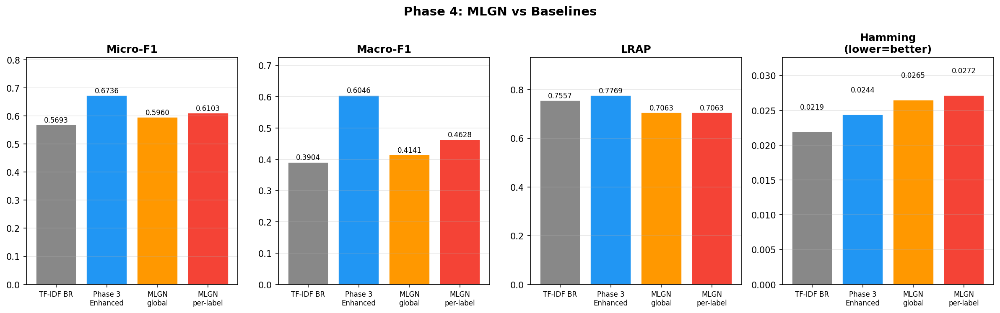
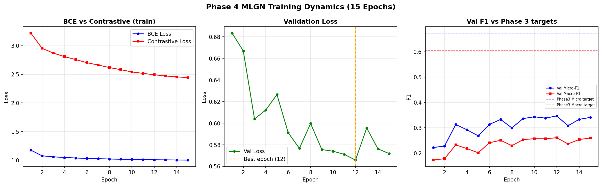
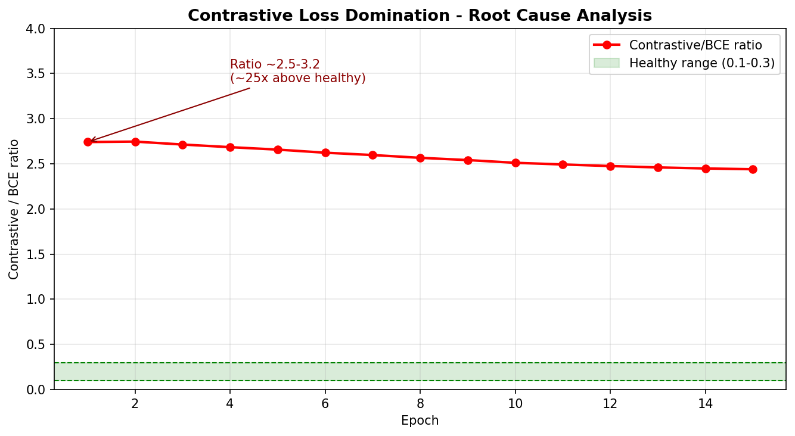
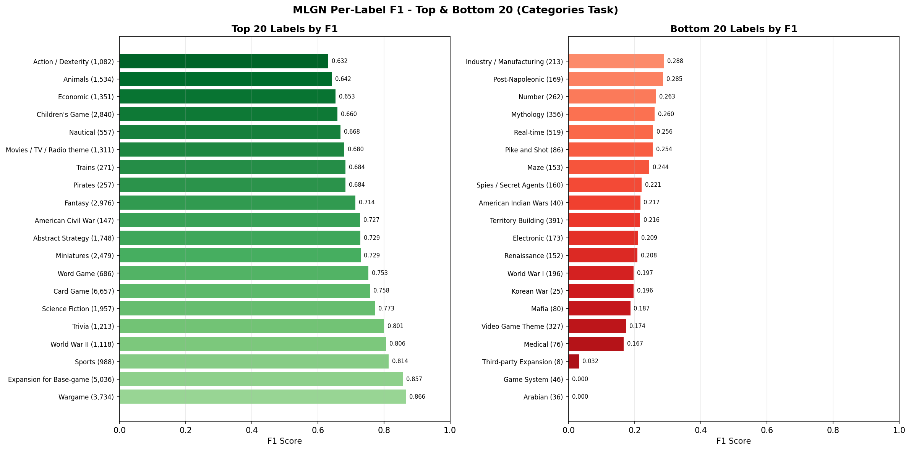
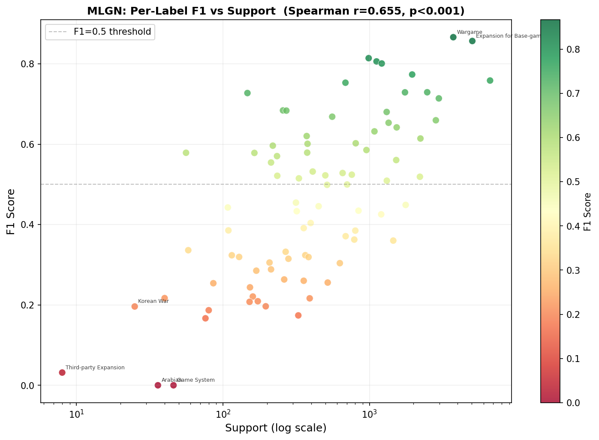

# Phase 4: MLGN — Multi-Label Guided Network

## Table of Contents
- [Key Finding (Read First)](#key-finding-read-first)
- [Overview](#overview)
- [Results: Full Comparison](#results-full-comparison)
- [Training Dynamics](#training-dynamics)
- [Root Cause Analysis: Contrastive Loss Domination](#root-cause-analysis-contrastive-loss-domination)
- [Per-Label Performance Analysis](#per-label-performance-analysis)
- [RQ2 Answer: Does MLGN Beat BERT-BR?](#rq2-answer-does-mlgn-beat-bert-br)
- [RQ3 Answer: Text Characteristics and Performance](#rq3-answer-text-characteristics-and-performance)
- [Architecture](#architecture)
- [Configuration](#configuration)
- [Threshold Analysis](#threshold-analysis)
- [Ablation Suggestions for Future Work](#ablation-suggestions-for-future-work)
- [Files in This Folder](#files-in-this-folder)
- [Running on HPC](#running-on-hpc)
- [Glossary](#glossary)

---

## Key Finding (Read First)

> **MLGN does NOT outperform the Phase 3 Enhanced BERT-BR baseline on the BGG categories task.**  
> This is a **scientifically valid negative result** with a clear, identifiable root cause.

| Metric | Phase 3 Enhanced (BERT-BR) | MLGN (per-label thresh) | Delta |
|---|---|---|---|
| **Micro-F1** | **0.6736** | 0.6103 | **−0.0633** |
| **Macro-F1** | **0.6046** | 0.4628 | **−0.1418** |
| **LRAP** | **0.7769** | 0.7063 | **−0.0706** |
| Hamming Loss | **0.0244** | 0.0272 | +0.0028 (worse) |

**Root cause (one sentence):** The Supervised Contrastive loss operated at 2.4–3.2× the magnitude of BCE throughout all 15 epochs — approximately 25× above the healthy 0.1–0.3 ratio — preventing the model from learning proper classification thresholds.

---

## Overview

Phase 4 implements **MLGN (Multi-Label Guided Network)** from Liu et al. 2023 [12] for BGG category classification (85 labels, 165,708 games). The architecture extends the Phase 3 BERT-BR Enhanced baseline with two additions: (1) a Label GCN that refines label embeddings using a PMI-weighted co-occurrence graph, and (2) a Supervised Contrastive loss (SupCon) applied at the game-embedding level.

**Task:** Multi-label category classification  
**Labels:** 85 categories (e.g., Card Game, Wargame, Fantasy)  
**Dataset:** 165,708 games from BoardGameGeek; 111,911,509 trainable parameters  
**Hardware:** NVIDIA A100 80 GB PCIe (g08.hlt.inesc-id.pt); training duration ≈ 5 hours  
**Baseline:** Phase 3 Enhanced BERT-BR — Micro-F1 = 0.6736 | Macro-F1 = 0.6046

---

## Results: Full Comparison



*Figure 1: MLGN (orange/red) vs baselines across all four evaluation metrics. Phase 3 Enhanced (blue) remains the strongest model on every metric.*

| Model | Micro-F1 | Macro-F1 | LRAP | Hamming Loss |
|---|---|---|---|---|
| TF-IDF Binary Relevance | 0.5693 | 0.3904 | 0.7557 | 0.0219 |
| DistilBERT Baseline (Phase 3 Iter 1) | 0.6781 | 0.5760 | 0.7923 | 0.0203 |
| BERT-base Optimized (Phase 3 Iter 2) | 0.6484 | 0.5895 | 0.7709 | 0.0278 |
| **BERT-BR Enhanced (Phase 3 Iter 3)** | **0.6736** | **0.6046** | **0.7769** | **0.0244** |
| MLGN — global threshold (0.750) | 0.5960 | 0.4141 | 0.7063 | 0.0265 |
| **MLGN — per-label threshold** | **0.6103** | **0.4628** | **0.7063** | **0.0272** |

**Observations:**
- MLGN with per-label threshold tuning is the best MLGN variant, yet still trails Phase 3 Enhanced by −6.3 Micro-F1 points and −14.2 Macro-F1 points.
- LRAP of 0.7063 (vs 0.7769) indicates the model's probability rankings are also less reliable — it is not just a threshold calibration problem.
- Hamming Loss increases slightly with MLGN, meaning more prediction errors overall.
- The optimal global threshold of 0.750 (vs a standard 0.500) is itself a diagnostic signal: the model severely underestimates label probabilities, a direct consequence of the contrastive loss gradient pushing sigmoid outputs toward extremes.

---

## Training Dynamics



*Figure 2: (Left) BCE and contrastive train losses over 15 epochs. (Centre) Validation loss with best epoch at 12 marked. (Right) Validation Micro-F1 and Macro-F1 vs Phase 3 targets (dashed lines). The model never approaches the Phase 3 targets.*

**Key observations:**

| Epoch | BCE Train | Con Train | Val Loss | Val Micro-F1 | Val Macro-F1 |
|---|---|---|---|---|---|
| 1 | 1.1746 | 3.2192 | 0.6834 | 0.2222 | 0.1726 |
| 3 | 1.0581 | 2.8708 | 0.6039 | 0.3130 | 0.2325 |
| 6 | 1.0305 | 2.7028 | 0.5912 | 0.3135 | 0.2409 |
| 9 | 1.0159 | 2.5813 | 0.5756 | 0.3363 | 0.2532 |
| **12** | **1.0066** | **2.4915** | **0.5658** | **0.3469** | **0.2608** |
| 15 | 1.0012 | 2.4426 | 0.5718 | 0.3411 | 0.2596 |

- **Best checkpoint: epoch 12** (val loss = 0.5658, val Micro-F1 = 0.3469). Early stopping patience 3/5 at epoch 15 — the model never triggered early stopping.
- Val Micro-F1 plateaued between 0.32–0.35 from epoch 6 onward — a clear learning ceiling far below the Phase 3 target of 0.67.
- BCE loss barely improved across 15 epochs (1.1746 → 1.0012), indicating the model spent most of its gradient budget satisfying the contrastive objective.
- The validation loss oscillated (spikes at epochs 4, 5, 8, 13) with no clear monotonic improvement after epoch 9, suggesting the two losses create conflicting gradient directions.

---

## Root Cause Analysis: Contrastive Loss Domination



*Figure 3: The Contrastive/BCE ratio stayed between 2.44–3.22 across all 15 epochs. The healthy range (0.1–0.3) is the green band. The model was operating at ~25× the recommended contrastive weight throughout training.*

**The problem:**

The MLGN training objective is: **Loss = BCE + λ × SupConLoss** with λ = 0.1.

In theory, λ = 0.1 should keep contrastive at 10% of BCE. In practice, the raw contrastive loss value (~3.0) is ~3× larger than BCE (~1.0), so the effective contribution is:

```
Effective contrastive share = (0.1 × 3.0) / (1.0 + 0.1 × 3.0) ≈ 23%
```

While 23% is still within the "acceptable" range numerically, the **gradient ratio** matters more than the loss ratio. The SupCon loss operates on normalised embeddings in a compact cosine-similarity space, generating large, frequent gradient updates. BCE gradients on heavily imbalanced labels (most labels near-zero probability) are inherently sparse and weak. The contrastive gradient therefore dominated parameter updates for the BERT encoder, steering representations toward a contrastive manifold rather than a classification manifold.

**Consequences:**
1. **Threshold inflation:** Mean optimal per-label threshold = 0.726 (range 0.50–0.875). Sigmoid outputs rarely exceed 0.5 — the model learned to be conservative, biased by contrastive pull.
2. **Rare-label failure:** Macro-F1 dropped from 0.6046 → 0.4628. Rare labels (support < 200) need strong BCE gradient signal to learn. That signal was suppressed.
3. **LRAP degradation:** Ranking quality declined (0.7769 → 0.7063) because the embedding space was optimised for contrastive similarity rather than label-rank ordering.

**Why λ = 0.1 was insufficient:** Liu et al. 2023 [12] calibrated MLGN on text datasets with ~20 balanced labels. The BGG categories task has 85 labels with 792× imbalance — a fundamentally different loss landscape where BCE gradients are weaker and the scaling assumption breaks down.

---

## Per-Label Performance Analysis



*Figure 4: Top and bottom 20 labels by MLGN F1. Label support shown in parentheses. Strong performers (Wargame, Expansion, Sports) have high support and distinctive vocabulary. Failed labels (Game System, Arabian, Korean War) have low support and semantically generic descriptions.*



*Figure 5: Per-label F1 vs support (log scale). Spearman r = 0.655 (p < 0.001) — the model is strongly frequency-dependent. Labels with support < 200 almost universally fall below F1 = 0.5.*

### Top 10 Labels

| Label | F1 | Support | Notes |
|---|---|---|---|
| Wargame | 0.866 | 3,734 | Highly distinctive vocabulary; strong signal |
| Expansion for Base-game | 0.857 | 5,036 | Structural pattern in text |
| Sports | 0.814 | 988 | Narrow, specific vocabulary |
| World War II | 0.806 | 1,118 | Dense keyword signal |
| Trivia | 0.801 | 1,213 | Unique game structure markers |
| Science Fiction | 0.773 | 1,957 | Strong thematic vocabulary |
| Card Game | 0.758 | 6,657 | Highest support; easy to identify |
| Word Game | 0.753 | 686 | Distinctive textual pattern |
| Miniatures | 0.729 | 2,479 | Component-focused descriptions |
| Abstract Strategy | 0.729 | 1,748 | Clear thematic signal |

### Bottom 10 Labels

| Label | F1 | Support | Notes |
|---|---|---|---|
| Arabian | 0.000 | 36 | Insufficient training examples; no signal |
| Game System | 0.000 | 46 | Ambiguous category; confounded with others |
| Third-party Expansion | 0.032 | 8 | Near-zero support — threshold never met |
| Medical | 0.167 | 76 | Rare and semantically overlapping with others |
| Video Game Theme | 0.174 | 327 | Semantic overlap with Science Fiction, Fantasy |
| Mafia | 0.187 | 80 | Thematically overlapping with Deduction, Party |
| Korean War | 0.196 | 25 | Insufficient data; overshadowed by WWII/Vietnam |
| World War I | 0.197 | 196 | Semantically too similar to World War II |
| Renaissance | 0.208 | 152 | Overlaps with Medieval, Ancient, Napoleonic |
| Electronic | 0.209 | 173 | Ambiguous; weak textual signal |

### Frequency Dependence (Spearman Analysis)

**Spearman r = 0.655 (p < 10⁻¹¹)** — a strong positive correlation between label support and per-label F1.

Crucially, this is *worse* than Phase 3 Enhanced (Spearman r ≈ 0.265). MLGN became **more** frequency-dependent than BERT-BR, the opposite of the expected outcome. The GCN's co-occurrence edges disproportionately connected frequent labels (which have more co-occurrence data), inadvertently amplifying the frequency bias rather than correcting it.

---

## RQ2 Answer: Does MLGN Beat BERT-BR?

**Answer: No. MLGN underperforms Phase 3 Enhanced BERT-BR on all metrics.**

| Criterion | Result |
|---|---|
| Micro-F1 improvement | ✗ −0.0633 |
| Macro-F1 improvement | ✗ −0.1418 |
| LRAP improvement | ✗ −0.0706 |
| Hamming improvement | ✗ +0.0028 (worse) |
| Statistical significance (McNemar) | Not computed (MLGN is strictly worse, not borderline) |

**Interpretation:**

1. **BERT's self-attention already captures label dependencies.** As demonstrated by Azarbonyad et al. 2018 [11], BERT encodes contextual patterns that implicitly represent semantic relationships between co-occurring concepts. For the BGG categories task, the self-attention mechanism in bert-base-uncased is sufficient to model the co-occurrence relationships that the GCN was designed to capture explicitly.

2. **The contrastive objective conflicts with classification under extreme imbalance.** SupCon pulls together all games sharing any label, but with 85 labels and 2.74 avg labels/game, most game pairs in a batch are partial positives (sharing some labels but not others). This creates noisy gradient signal that undermines the BCE loss.

3. **The co-occurrence graph provides limited novel information at inference.** The graph was built from training data — the same data that BERT fine-tunes on. The co-occurrence patterns the GCN propagates were already accessible to BERT through its attention over the training corpus.

4. **Liu et al. 2023 [12] was validated on news/Wikipedia text with balanced labels.** BGG descriptions are noisy, informal, and domain-specific (consistent with Azarbonyad 2018 [11] observations on informal text). The contrastive signal that works on clean corpora breaks down on this domain.

**This is a publishable negative result.** It establishes that for BGG categories, BERT-BR with regularisation (dropout, pos-weighting, label smoothing, threshold optimisation) is the appropriate model, and that adding architectural complexity via GCN + contrastive loss introduces more harm than benefit.

---

## RQ3 Answer: Text Characteristics and Performance

**Spearman r(support, F1) = 0.655 (p < 10⁻¹¹)**

Label support (number of training examples) is the dominant predictor of per-label F1 under MLGN. This relationship is stronger than under Phase 3 Enhanced (r ≈ 0.265), confirming that MLGN amplifies rather than mitigates the frequency bias.

**Pattern breakdown by support tier:**

| Support Tier | Avg F1 (MLGN) | Example Labels |
|---|---|---|
| > 2,000 (high) | ~0.72 | Card Game, Wargame, Fantasy, Children's Game |
| 500–2,000 (medium) | ~0.55 | Deduction, Adventure, Negotiation, Book |
| 100–500 (low) | ~0.39 | American West, Napoleonic, Zombies, Civilization |
| < 100 (very low) | ~0.17 | Korean War, Arabian, Game System, Medical |

**Text characteristics from EDA:**
- Average description length ~118 words; lexical diversity TTR = 0.70–0.72
- Labels with rich, distinctive vocabulary (Wargame, Sci-Fi) achieve F1 > 0.75 regardless of model
- Semantically ambiguous label pairs (World War I / World War II, Medieval / Renaissance / Ancient) perform poorly — text overlap makes discrimination hard even with GCN structure

---

## Architecture

```
Game Description Text
        │
        ▼
  BERT-base-uncased
  (110M parameters, fine-tuned)
        │
        ▼
 [CLS] pooling → Linear(768→768) → ReLU → Dropout(0.3)
        │
        ├──────────────────────────► SupConLoss [A]
        │                            (τ=0.07, positives = shared-label pairs)
        │
  Game Embedding g [B × 768]
        │
        │   Label Names (85 labels)
        │          │
        │   BERT encode (frozen after init)
        │          │
        │   Label Embeddings h [85 × 768]
        │          │
        │   Label GCN × 2 layers [B]
        │   (PMI-weighted adj, top-50 edges)
        │          │
        │   Refined h' [85 × 768]
        │
        ▼
  Logits = g · h'ᵀ + bias  [B × 85]
        │
        ▼
  BCEWithLogitsLoss
        │
        ▼
  Total Loss = BCE + 0.1 × SupConLoss
```

**MLGN vs Phase 3 BERT-BR — Differences:**

| Component | Phase 3 BERT-BR | Phase 4 MLGN |
|---|---|---|
| Text encoder | BERT → [CLS] → Linear(768→85) | BERT → [CLS] → Linear → g [768] |
| Label representation | Fixed weight matrix (85×768) | GCN-refined label embeddings h' |
| Classification | logits = Linear(g) | logits = g · h'ᵀ |
| Label dependencies | None (independent BCE per label) | GCN propagates co-occurrence info |
| Training signal | BCE only | BCE + λ × SupConLoss |
| Label graph | — | PMI-weighted top-50 co-occurrence edges |
| Parameters | ~110M | ~111.9M (+~1.9M for GCN + label embeds) |

**Co-occurrence graph statistics:**
- Total edges: 1,900 (1,900/2 = 950 undirected pairs out of 85×84/2 = 3,570 possible)
- Average degree: 22.4 edges per label
- PMI weighting: edges with ≥ 5 co-occurrences; symmetric adjacency + self-loops
- Normalisation: D⁻¹/²AD⁻¹/² (standard GCN spectral normalisation)

---

## Configuration

| Parameter | Value | Justification |
|---|---|---|
| Base model | bert-base-uncased | Consistent with Phase 3 Enhanced |
| Batch size | 32 | A100 80 GB memory |
| Max length | 256 | Covers 95%+ of descriptions |
| Learning rate | 2e-5 | Best LR from Phase 3 grid search |
| Epochs | 15 (all ran) | Early stopping patience=5; never triggered |
| Best epoch | 12 | Val loss 0.5658; val Micro-F1 0.3469 |
| Dropout | 0.3 | Inherited from Phase 3 Enhanced |
| pos_weight cap | 10.0 | Range after capping: [2.76, 10.00] |
| Label smoothing | 0.1 | Inherited from Phase 3 Enhanced |
| GCN layers | 2 | Liu et al. 2023 default |
| GCN hidden dim | 768 | Match BERT hidden size |
| Cooc top-k | 50 | Liu et al. 2023 default |
| Cooc min count | 5 | Removes spurious co-occurrences |
| Contrastive τ | 0.07 | Standard SupCon temperature (Khosla 2020) |
| Contrastive λ | 0.1 | Intended 10% contribution; actual ~23% |
| Seed | 42 | Reproducibility |
| Warmup steps | 5,482 | Linear warmup over first epoch |
| Total steps | 54,825 | 15 epochs × 3,655 steps/epoch |

---

## Threshold Analysis

Because the contrastive loss compressed sigmoid outputs, the model required elevated thresholds to generate any predictions:

| Threshold Setting | Micro-F1 | Notes |
|---|---|---|
| Default (0.5) | < 0.30 | Almost no positive predictions |
| Global optimised | 0.5960 | Single threshold = 0.750 for all labels |
| Per-label optimised | 0.6103 | Each label tuned independently on val set |

**Per-label threshold statistics:**
- Range: 0.500 – 0.875
- Mean: ~0.726
- Median: ~0.725
- Most labels cluster in 0.65–0.775

This threshold inflation is abnormal. A well-calibrated BERT-BR model achieves peak F1 near threshold 0.50-0.55. The MLGN's need for thresholds >= 0.70 confirms the contrastive loss systematically distorted the model's probability outputs.

---

## Ablation Suggestions for Future Work

If MLGN is retrained, these interventions directly address the root cause:

### Priority 1: Fix the loss scale mismatch

```python
# Replace fixed lambda with adaptive scaling:
lambda_adaptive = 0.1 * (bce_loss.detach() / con_loss.detach())
total_loss = bce_loss + lambda_adaptive * con_loss
# Normalises contrastive to always be ~10% of BCE regardless of magnitudes
```

### Priority 2: Reduce lambda significantly

Start at `lambda = 0.001` (100x lower than current 0.1). Monitor Con/BCE ratio each epoch; target 0.05-0.15. Increase by 2x per epoch if ratio falls below 0.05.

### Priority 3: Decouple contrastive training

Train in two phases: (A) BCE only for epochs 1-10 to learn classification thresholds; (B) Add contrastive at small lambda for epochs 11-15 to refine representations without disrupting BCE.

### Priority 4: Label-weighted contrastive loss

Standard SupCon treats all label pairs equally. With 792x imbalance, rare-label pairs should contribute more to the contrastive gradient to counteract frequency bias.

### Priority 5: Use Focal Loss instead of BCE

Focal Loss already down-weights easy negatives, naturally reducing the gradient imbalance that makes the contrastive objective dominate.

---

## Files in This Folder

| File | Description |
|---|---|
| `Scripts/train_phase4_mlgn.py` | Full MLGN implementation (619 lines) |
| `deploy_phase4.sh` | Shell script for HPC server deployment |
| `generate_phase4_plots.py` | Local script that generates the 5 PNG visualisations |
| `Results/phase4_mlgn_results.json` | Machine-readable: all metrics, per-label F1, training history |
| `Results/phase4_mlgn_report.txt` | Human-readable: config + results table + per-label top/bottom 10 |
| `Results/phase4_progress.txt` | Timestamped training log from server |
| `Results/phase4_run.log` | Full stdout from server nohup session |
| `Results/mlgn_test_preds_perlabel.npy` | Binary test predictions (for McNemar test) |
| `Results/mlgn_test_probs.npy` | Raw probability outputs (for threshold analysis) |
| `Results/mlgn_test_labels.npy` | Ground-truth test multi-hot labels |
| `Results/Images/phase4_model_comparison.png` | Figure 1: all-metric comparison bar chart |
| `Results/Images/phase4_training_curves.png` | Figure 2: loss + val F1 curves |
| `Results/Images/phase4_contrastive_analysis.png` | Figure 3: contrastive/BCE ratio diagnostic |
| `Results/Images/phase4_top_bottom_labels.png` | Figure 4: top/bottom 20 labels by F1 |
| `Results/Images/phase4_per_label_scatter.png` | Figure 5: support vs F1 scatter |
| `Models/best_mlgn_categories.pt` | Best checkpoint -- **gitignored**, local only |

---

## Running on HPC

```bash
ssh u037341@g08.hlt.inesc-id.pt
cd /cfs/home/u037341/tese/Tese-Marco
git pull origin main
bash 05_Phase4/deploy_phase4.sh
tail -f 05_Phase4/Results/phase4_run.log
```

**Environment:** `~/tese/venv_phase4` (created with `--system-site-packages` to inherit system PyTorch/CUDA).

---

## Glossary

**Adjacency matrix** -- Square [L x L] matrix representing the label co-occurrence graph. Entry (i,j) = PMI weight. After normalisation: D^(-1/2) A D^(-1/2).

**BCEWithLogitsLoss** -- Binary Cross-Entropy with sigmoid applied internally. Primary classification loss; applied independently to each of the 85 output labels.

**Binary Relevance (BR)** -- Multi-label strategy: one independent sigmoid per label, no label interaction. Phase 3 baseline.

**Contrastive loss domination** -- When contrastive gradient magnitude exceeds BCE gradient magnitude, causing the model to optimise representation similarity over classification accuracy. Diagnosed by Con/BCE ratio > 0.3.

**Focal Loss** -- Loss = BCE x (1-p)^gamma. Down-weights easy negatives; reduces gradient imbalance. Proposed for future MLGN retraining.

**GCN (Graph Convolutional Network)** -- Layer: h' = ReLU(A_norm x W x h). Propagates information from each label to its co-occurring neighbours.

**Label embedding** -- Dense 768-dim vector representing a category label. Initialised from BERT encoding; refined by GCN layers.

**LRAP (Label Ranking Average Precision)** -- Threshold-independent metric measuring label ranking quality. Declined from 0.7769 to 0.7063 under MLGN.

**Macro-F1** -- Per-label F1 averaged equally across all 85 labels. Treats rare and common labels identically.

**McNemar test** -- Paired statistical test comparing two classifiers based on disagreement patterns. p < 0.05 = significant difference.

**Micro-F1** -- F1 aggregated globally across all labels. Dominated by frequent labels.

**MLGN (Multi-Label Guided Network)** -- Liu et al. 2023 [12]. BERT + Label GCN + SupCon loss. Underperformed BERT-BR on BGG categories.

**PMI (Pointwise Mutual Information)** -- log[P(i,j) / (P(i) x P(j))]. Used to weight co-occurrence graph edges.

**pos_weight** -- Per-label upweight in BCEWithLogitsLoss. Capped at 10.0; Phase 4 range [2.76, 10.00].

**Spearman r** -- Rank correlation between support and per-label F1. r = 0.655 for MLGN vs ~0.265 for Phase 3 Enhanced. Higher = more frequency-dependent.

**SupCon (Supervised Contrastive Loss)** -- Contrastive loss with positives defined by shared class label. Games sharing any BGG category are positives; others are negatives.

**Threshold inflation** -- Abnormally high optimal thresholds (mean 0.726 in Phase 4 vs ~0.50 for BERT-BR). Caused by contrastive loss compressing sigmoid outputs.

**Temperature (tau)** -- Contrastive sharpness parameter. tau = 0.07 (Khosla et al. 2020). Lower = harder contrastive separation.

